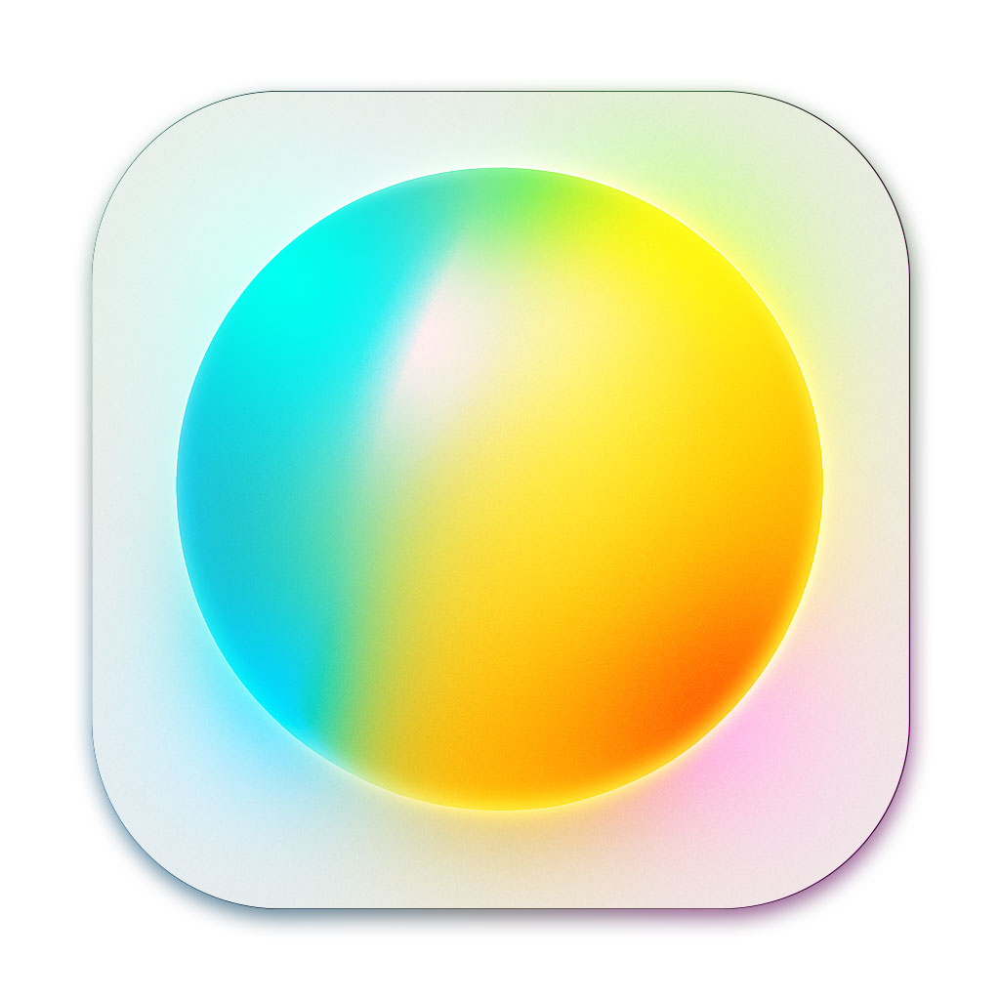

<p align="center">
  
</p>

# Echo

macOS向けの音声操作アシスタントです。OSの操作や定型的なタスクを、ユーザーの隣にいるエージェントとして実行することを目指しています。

[](https://opensource.org/licenses/MIT)

## 概要

本アプリケーションは、より柔軟で実践的なAIアシスタントの可能性を探るために開発されました。Apple Intelligenceの思想とは異なり、利便性のためにある程度のリスクを許容する実験的なプロジェクトです。

音声コマンドによってMacの操作を補助し、将来的には自律的なエージェントとしてユーザーの作業を代行することを目指しています。

**現在のバージョン:** `0.01`

### 主な機能 (v0.01)
* 音声入力でAIと対話し、タスクを依頼できる  
* AIの返答は音声で返ってくる  
* タスクや会話は短く軽量で、サーバーへの送信内容は自動で圧縮される  
* MCP（Model Context Protocol）と連携して動作する  

#### MCPと連携してできる機能一覧
| 用途             | 機能                            | MCP              |
|------------------|---------------------------------|------------------|
| YouTube操作       | 検索、再生、停止         | [playwright-mcp](https://github.com/microsoft/playwright-mcp) |
| Google検索           | 調べ物               | [playwright-mcp](https://github.com/microsoft/playwright-mcp) |
| 天気確認           | 今日・週間の天気を取得               | [playwright-mcp](https://github.com/microsoft/playwright-mcp) |
| 買い物リスト管理   | 追加、編集、削除、確認               | [filesystem-mcp](https://github.com/modelcontextprotocol/servers/tree/main/src/filesystem)     |
| Youtube広告のスキップ   | 広告のスキップ               | [mac-control-mcp](https://github.com/belcrod5/mac-control-mcp)     |
| アプリケーションOCR   | Macで起動中のアプリのテキストを判別、判別からクリックも可能               | [mac-control-mcp](https://github.com/belcrod5/mac-control-mcp)     |
| 音量操作   | Macの音量をパーセンテージ指定で変更します               | [mac-control-mcp](https://github.com/belcrod5/mac-control-mcp)     |
| ノイズキャンセル操作   | ノイズキャンセルのON、OFFの操作               | [mac-control-mcp](https://github.com/belcrod5/mac-control-mcp)     |


**注意:** 本バージョンでは、ユーザーの音声や操作に関する情報が、設定されたLLMのサーバーへ送信されます。プライバシーに関するリスクをご理解の上、ご自身の責任でご使用ください。

---

## インストール方法

ダウンロードした zipファイルを解凍し、/Application 配下にコピーし起動します

---

## セットアップ

アプリケーションを動作させるには、いくつかの初期設定が必要です。

### 最低限の設定
'~/Library/Application Support/echo/server'のディレクトリを開きます

#### 以下をリネームします
* .env.example → .env
* settings
    * llm_configs_template.json → llm_configs.json
    * server_configs_template.json → server_configs.json

#### ファイルの内容の変更
1. **.env**の OPENROUTER_API_KEY, GOOGLE_GENERATIVE_AI_API_KEY のどちらかにAPIキーを設定します
1. **llm_configs.json** providerを "gemini"もしくは"openrouter"のどちらかを指定
1. **server_configs.json** *@modelcontextprotocol/server-filesystem*<br />メモなどのファイルアクセスを許可するパスを設定。詳しくは [filesystem mcp](https://github.com/modelcontextprotocol/servers/tree/main/src/filesystem) をご確認ください

### 推奨のセットアップ
[mac-control-mcp](https://github.com/belcrod5/mac-control-mcp) をダウンロードし
**server_configs.json** に以下を追加
```json
{
    "command": "node",
    "args": [
        "{ダウンロードしたパス}/mac-control-mcp/index.js"
    ]
}
```
詳細は [mac-control-mcp](https://github.com/belcrod5/mac-control-mcp) をご確認ください

## 使い方

基本的な使い方をいくつか紹介します。

| 操作内容 | 音声コマンドの例 |
| :--- | :--- |
| **YouTubeを停止する** | 「Youtubeでオムライスの作り方を検索してください」 | 
| **買い物リストに追加** | 「買い物リストに卵を追加して」 | 
| **天気を尋ねる** | 「今日の天気は？」 | 


---

## 今後の開発ロードマップ

* **エージェントの複数化と交代機能**
    * タスクの得意分野に応じて、アシスタントを切り替える機能。
* **エージェント間連携（A2A）**
    * 複数のエージェントが協調して、より複雑な問題解決に取り組みます。
* **操作学習機能**
    * ユーザーのUI操作から作業内容を学習し、自動化を提案します。
* **他デバイス連携**
    * スマートフォンなど、別のデバイスからmacOS上のEchoに指示を出す機能。

---

## ⚠️ 注意事項

本アプリケーションは実験的な段階にあります。使用すると思わぬ動作を引き起こす可能性がありますので、自己責任でご利用ください。

### 開発中に確認されたAIの予期せぬ挙動

LLMのモデルによっては、以下のような意図しない動作が確認されています。

* **メッセージアプリの誤操作:** 特定の相手へのメッセージ送信を指示した際、別ユーザーのウィンドウを複数開いてしまうことがありました。
* **過剰な提案:** 「子供の声で作業に集中できない」という趣旨の発言に対し、ノイズキャンセリング機能で声を遮断する提案をすることがありました。

これらの挙動はアプリケーションの不具合というより、LLMの判断によるものです。機密情報や重要なデータを取り扱っている状態での使用は推奨しません。

---

## コントリビュート

本プロジェクトへの貢献を歓迎します。バグ報告や機能提案は[Issues](https://github.com/YOUR_USERNAME/echo/issues)へ、コードの改善はPull Requestにてお願いします。

初めての方は `good first issue` ラベルの付いたIssueから着手することをお勧めします。

### コントリビューターへの還元について

将来的には、プロジェクトから収益が発生した場合、その一部をコントリビューターへ分配することを検討しています。

分配方法の詳細はまだ確定していませんが、GitHub SponsorsやOpen Collectiveなどの仕組みを利用し、貢献度に応じて公正に行う予定です。具体的な方針は、決まり次第 `CONTRIBUTING.md` に記載します。

---

## ライセンス

本プロジェクトは [MIT License](LICENSE) の下で公開されています。

ただし、将来的にプロジェクトの継続性を担保するため、商用利用を制限するライセンス（BUSLなど）へ変更する可能性があることをご了承ください。